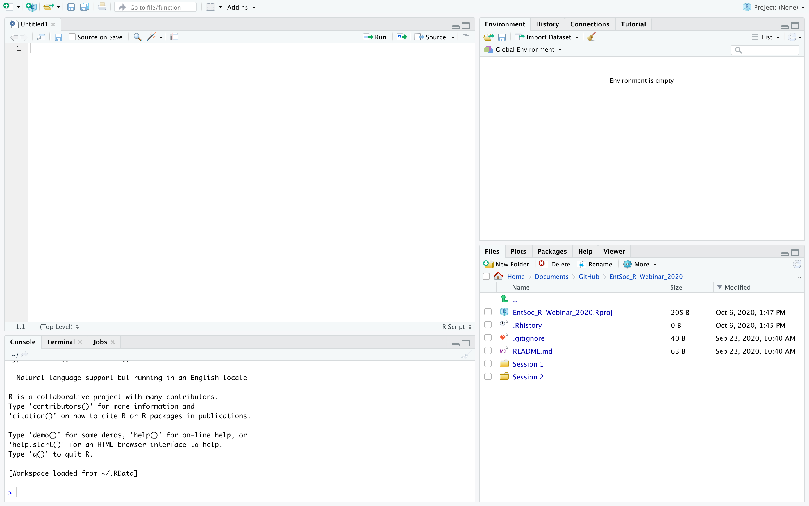

**Description:** This session will lay a coding foundation for R beginners. We will familiarize you with using the RStudio interface, RScripts and RMarkdown. Students will learn basic commands in the ever-changing R language, how to interpret errors and package installation. We will use these tools to wrangle and visualize data using Tidyverse packages.

## 1. Introduction to RStudio, R Scripts, RMarkdown/RNotebooks, and R Projects. 
### a. What is R?
[R](https://cloud.r-project.org/) is a programming language. Essentially, R is a medium for dialogue between you and your computer about your data. We shall highlight the lingual aspects of R throughout this introduction.

### b. Why use R?
 

R is:

* Free and open sourced
  + Google-friendly
* [Repeatable and reproducible](https://www.britishecologicalsociety.org/wp-content/uploads/2017/12/guide-to-reproducible-code.pdf)
* Easy to share
* Won't alter your original data
* Saves time with reapplication
* Has community sourced packages
* Has a helpful online community

### c. What does R do?
R is a way of telling your computer what you want done with your data. This language is geared toward mathematics, which is your computer's forte (hence the name). You will need to think like a computer. We will see that this language is very specific about what it wants and what it will give you- pay attention to these details!

### d. What does R **not** do?
**Learning R is not learning statistics!** R can implement any number of statistical tests and analyses, and regardless of if they're appropriate, it will run them on properly formatted data. Be careful to have a plan for what statistics you want to calculate before you start coding.

### e. Why do I need RStudio?
Primarily, [RStudio](https://rstudio.com/products/rstudio/) provides a graphical user interface for coding in R. R alone is a console: a blank line asking for immediate instructions. Certainly, you can quickly code something like this, but part of coding is writing scripts that are reproducible. RStudio allows you to view:

1. Source (scripts and data)
2. Environment (saved objects and functions)
3. The console (where commands are run)
4. Files, Packages and Help (to orient you)

RStudio makes it easier to navigate between code, the console and output, while also displaying the characteristics of your R environment. You can think of RStudio as an "R organizer".



### f. What are R scripts?
R scripts list commands you want to write, edit and save. In a simple example, a script may load data (command 1), calculate a statistic on that data (command 2), then plot that statistic (command 3). With this script in hand, you can instantly run the exact same analysis. You can also share this script and data and allow colleagues to replicate and contribute to the analysis.

### g. Why use RMarkdown or RNotebooks?
[RMarkdown](https://rmarkdown.rstudio.com/lesson-1.html) and and RNotebooks allow you to create sharable documents that combine a written narrative, code and results. [RMarkdown syntax](https://rstudio.com/wp-content/uploads/2015/02/rmarkdown-cheatsheet.pdf), which is used in RNotebooks, can be [knit](https://yihui.org/knitr/) into pdfs, docs or html files. RMarkdown and RNotebooks also allow you to run and view chunks of code within the document. (This was written via RMarkdown).

### h. What are R Projects?
R Projects streamline your script development. A .Rproj file keeps track of what files you are viewing and will ensure you have a consistent working directory.

* R Projects open in their own R session, which allows you to jump right back into coding
* You can share a folder with someone and they can immediately navigate these files and all the code will work: your R project folder is computer agnostic
* You can run multiple R Projects at once

## 2. R as a calculator
The R base language has intuitive math functions built in. These will follow order of operations.

```{r}
1+2
1+2*3
(1+2)*3
2^3
3/4
```

## 3. R as an object-oriented language (nouns)
Information is stored in R as objects. We can store the results from our calculations as an object that is stored in our environment.

```{r store an object, include=T}
math <- 3/4
words <- "hello world"

math
words

class(math)
class(words)
```

R objects have a wide variety of classes. Seven fundamental classes are:

* Number
* Character
* Factor
* Integer
* Matrix
* Data frame
* Logical

**Number**
```{r number, include=T}
as.numeric(x=5)
```
**Character**
```{r character, include=T}
as.character(5)
```
**Factor**
```{r factor, include=T}
factor(5)
```
**Integer**
```{r integer, include=T}
as.integer(5)
```
* Matrix
```{r matrix, include=T}
matrix(5)
```
**Data frame**
```{r data frame, include=T}
data.frame(col=5)
```
**Logical**
```{r logical, include=T}
is.na(5)
```

These examples are all ephemeral: R read our command and returned what we asked for, but objects are much more powerful when you store them. Typically you will store whatever objects you're working with. You can store them in two ways:

```{r storing objects, include=T}
five <- as.numeric(5)
six = factor(6)

# Running the name of an object will display that object
five
six
```

Since I deviously created these objects named "five" and "six" in different classes, let's compare them. First, we can check the class for ourselves:

```{r check class, include=T}
class(five)
class(six)

five+five
six+six
```

We can also look at specific characteristics of these objects:

```{r object characteristics, include=T}
length(five)
length(six)

levels(six)
```

Levels are a powerful aspect of factors, let's take a deeper look at this:

```{r fun with factors, include=T}
c(12:1)
c("apples", "oranges", "pears", "bananas")

nums <- factor(c(12:1))
fruits <- factor(c("apples", "oranges", "pears", "bananas", "apples"))

nums
levels(nums)

fruits
levels(fruits)

as.character(nums)
as.numeric(nums)

as.character(fruits)
as.numeric(fruits)
as.numeric(as.character(fruits))
```

**Practice exercise 1:**
Create an object.

1. Create a vector of 1-4
2. Store this vector as an object
3. Add 1 to each number in this object

```{r practice exercise 1, include=T}

```

## 4. Taking action with functions (verbs)
### a. What is a function?
Programming generally can be considered as a series of pipes: information goes in, the pipe does something (a function), then information comes out. Your aim is to ensure that appropriate (quality) information goes in, and that the "pipe" is doing the right thing. This pipe metaphor is appropriate too when you consider the idea of a "square peg in a round hole". Half of the battle is understanding what type of information each function needs.

Functions can be thought of as verbs because they act on whatever objects you provide and often need additional information. Verbs not only tell you what is happening, but they also tell you something about when it happened and how many people were involved. The additional information you supply to functions are called arguments. Some are optional and others have defaults.

### b. The anatomy of a function
Regardless of what they do, functions share certain characteristics:

* Function name (can be any word)
* ( - marks the start of arguments for the function
* Arguments
  + Each argument has a name and can be set to something
  + Some arguments will have defaults
  + Some arguments will be optional
  + Without names, order of arguments matters
* ) - marks the end of arguments

A function can be generalized as: function(argument, argument, argument).

Let's explore some functions:

```{r functions, include=T}
# Note: Above boxes contain code that is sent to the console, and below boxes below are the output.

# The function c (short for "combine") returns its contents as vector/list
# If you're familiar with Excel, this is like concatenate
# The arguments for c are the objects you want to combine
seuss <- c(1, "fish", 2, "fish")
seuss

# A colon is the coding equivalent of "through" 1:3 returns 1, 2 and 3. 3:1 returns 3, 2 and 1.
nums <- c(1:100)
nums

mean(x = nums)
mean(nums)

# We can look at the help file to view arguments for a function
?mean
```

Since our object "seuss" contained numbers and words (words are "strings of characters" to your computer), this was formatted as a character class. A vector of 1-100 cooperates with the integer class, so the "nums" object is an integer class. This reliable behavior is built into the function c().

### c. You can create your own functions!
You may want to write your own function to streamline your code or share specific work flows with others. If you find yourself copying and hard-coding a few lines over and over, they may work better as a function.

To write your own function, you need to specify the arguments of the function, the name of the function and the commands within the function.

```{r bespoke functions, include=T}
# Here we will write a simple function that allows you to repeat "given numbers" (input: argument 1) x number of times" (n: argument 2) and take their sum. Within this custom function, we will use the functions rep(x, times) and sum(..., na.rm=F).

nums
nums2 <- rep(x=nums, times=2)

sum(nums2)

repsum <- function(input, n=2){
  reps=rep(x=input, times=n)
  sum(reps)
}

# Note: the object "reps" was created within our function and so will not be added to your environment
# Also Note: we established a default for n if that argument is missing.

repsum(input=nums)

# Relying on order for argument assignment
repsum(nums, 3)

repsum(input=nums, n=3)
```

Functions work the same when nested, but they can be hard to read when you're starting out.

```{r nested functions, include=T}
repsum2 <- function(input, n=2){
  sum(rep(x=input, times=n))
}

repsum2(nums)

repsum2(nums, n=3)
```

This nesting avoids creating the object "reps", but it will be harder for future you and others to read.

**Practice exercise 2:**
Write your own function.

1. Create an object with a series of numbers
3. Write a function with at least 2 arguments that alters its input
3. Run your function on your object
Tip: It's best to try your commands outside of your function first!

```{r practice exercise 2, include=T}

```

## 5. Creating loops and if/else statements
Loops allow you to iterate commands across a given list/vector (numeric or character). Similar to writing a function, these are initiated with a command, such as for() and if(), followed by commands enclosed within curly brackets.

The arguments within the function for() are formatted like this: variable name "in" list (see the examples below). This is followed by curly brackets that contain your commands. After the end of the curly brackets of the for() function, else() can be included with its own curly brackets. These seem deceptively simple.

```{r for loops, include=T}
# A for() loop alone
for(x in 1:10){
  y=2*x
  print(c(x, y))
  }
```

Without print() in your loops, R will silently do what you ask and not return anything. You have to direct the results within your for loop to some object in order to keep them. Loops often function by creating intermediate variables that are overwritten as the sequence progresses, so only the final version of your object will enter your environment.

if()/else() statements allow you to program commands based on some condition (a logical expression). The argument for if() is simply a conditional statement. We will first use the function ifelse(conditional, true value, false return value).

```{r ifelse, include=T}
ifelse(nums>50, "yes", "no")
```

The function if() can not handle vectors that have multiple values. In order to run if() and then else() across our object "nums", we will use a for loop.

```{r numeric for() loops with if/then statements, include=T}
if(nums<50){print("yes")
  }else(print("no"))

for(x in 1:length(nums)){
  if(nums[x]<50){print("yes")
    }else(print("no"))
}
```

We can use the built-in LETTERS object to run a for() loop on character object with nested if()/else() statements.

```{r character for() loops and if/then statements, include=T}
# We will create the object "VOWELS" for the conditional statements in our if() statement
VOWELS=c("A","E","I", "O", "U", "Y")
LETTERS

# The operator %in% returns whether the left side is contained within the right side
"A" %in% VOWELS

# We will also use the function rbind to bind rows to a dataset as our loop progresses
alpha.dat <- data.frame()
alpha.dat1 <- rbind(alpha.dat, (c("A", "is", "a", "vowel")))
alpha.dat2 <- rbind(alpha.dat1, (c("B", "is", "a", "consonant")))

for(x in LETTERS){
  if(x %in% VOWELS){
    alpha.dat <- rbind(alpha.dat, (c(x, "is", "a", "vowel")))
  }else{
    alpha.dat <- rbind(alpha.dat, c(x, "is", "a", "consonant"))
  }
}

alpha.dat
```

**Practice exercise 3:**
Alter the vowel-identifying loop above to identify vowels in the letters of your name.

```{r practice exercise 3, include=T}

```

## 6. Working with data
Data analysis in R is streamlined by the various tidyverse packages. We will use some below.

R is certainly equipped to do any kind of data manipulation; however, particularly when you're starting out, don't be afraid to make a small change in some other program (like Excel) to speed up your analysis. As you learn R, even minor data manipulation will become easier in RStudio. If you do need to alter your raw data, save it as a new file so your raw data stays raw.

### a. Creating, accessing and loading data
There are a variety of ways to load data in R. The simplest is to code data in manually. A data frame specifies columns and its contents, so for the example above.

```{r creating data, include=T}
# Create each column
blood <- rep(c("goose", "horse"), each=60)
individual <- rep(c(1:20), times=6)
replicate <- rep(c(1:3), each=20, times=2)
time <- rnorm(n=120, mean=60, sd=30)

# Combine into a data frame
mosq.dat <- data.frame(blood, individual, replicate, time)

dim(mosq.dat)

str(mosq.dat)
```

This would also work if our objects were nested within the data.frame() function. A tibble can be made the same way using the function tibble().

R also has data built in. You can peruse these datasets by running the function data(). These are immediately accessible to any R user simply by calling their names. Rather unfortunately, the only insect-oriented data is InsectSprays. This is described as "Effectiveness of Insect Sprays" and is described simply: "The counts of insects in agricultural experimental units treated with different insecticides." Despite this simplistic view of IPM, which dates back to a data analysis paper from 1942, we will use this simple data for manipulation below.

```{r accessing InsectSprays, include=T}
dat <- InsectSprays

head(dat)
tail(dat)

?InsectSprays
```

Typically, you will import in files you have generated yourself. Base R has the function read.csv(). The readr option will import data as a tibble and has more options that are intuitive. However, RStudio has an "Import Dataset" button, which gives you a user interface. I recommend using this and checking the preview provided. It will return in your console the command for importing that data.

We will import our own comma separated values file (csv) containing iNaturalist observations for Monarch butterflies from 2018-2020. This command was generated using the RStudio "Import Dataset" button, in which we specified the name iNat.dat (much easier to manage than "iNat_monarch2018_2020")

```{r load iNat data, include=T}
iNat.dat <- read.csv("Data/iNat_monarch2018_2020.csv")
```

### b. Manipulating data in base R
Now that we have our data loaded, we can manipulate it. Let's use some special characters to subsetting our InsectSprays data. $ will allow you to select specific columns. You can create new columns using this operator, as well.

```{r selecting columns, include=T}
dat

dat$count

# Here we are creating the column "n" with the value 30
dat$n <- 30
```

This $ operator can also calculate between columns (across a row). 

```{r calculate via columns, include=T}
dat$dead <- dat$n-dat$count
```

Double brackets function similar to the $ operator, except you can include a number or a name. Single brackets allow you to pick specific cells by coordinates: [row, column]. If a comma is not included, the value is assigned to column.

```{r brackets, include=T}
dat[[1]]
dat[["count"]]

# This command will extract the second row
dat[2,]

# This command will extract the second column
dat[2]

# This command will extract the value from the first column and the second through fourth row
dat[2:4,1]
```

The subset() function can select rows from a data frame based on a logical expression (T/F statement). We can select rows where >6 died like this:

```{r subset function, include=T}
subset(x=dat, subset=dat$dead>6)
```

Another useful function for subsetting is grep(). This function searches for patterns and returns where in a sequence that pattern occurs. We can use grep to find each row that contains our pattern "2" in the column count (i.e., 20, 12 and 2 would be included because they contain 2). 

```{r grep, include=T}
# grep() returns the row numbers
grep("2", dat$count)

# We can combine this with [] to subset those rows from our entire data frame
# Note: we need to include a comma after grep() so that [] does not default to columns
dat[grep("2", dat$count),]
```

### c. Exporting tables
Straightforward options such as write.csv() allow you to export objects out of R when you specify the object to export and the name for the new file. The default is to write directly to your working directory, so be careful to not overwrite anything important!

## 7. Packages, the tidyverse and tidy data
### a. What is a package?
Everything we've discussed so far is part of the base R language. These are functions that R knows out of the box. Packages extend that language for specific purposes: it's a vocabulary lesson or "extension pack" for R. Packages are a collection of functions for you to use, loosely organized by purpose or field. Some packages are designed for field-specific purposes and others are more general. Other scientists can upload their packages into repositories, which stores them and allows them to be easily downloaded. CRAN (The Comprehensive R Archive Network) is a major repository for R packages, but there are others, such as Bioconductor.

Packages will have manuals that explain each function in the package and each of its arguments. Packages will often also have tutorials or vignettes via vignette() that walk you through basic usage. These are a good jumping off point if you want to explore a new package. Packages and their documentation can be updated and maintained by scientists who write them.

To install a package, you can use the command install.packages(). You can install packages by supplying a character or vector of characters: "package" or c("package 1", "package 2").

Use this command or the GUI:
> install.packages("readr")

Packages will be downloaded and stored as a binary that you can call with the command library(package). Even if you have installed a package, a new session of R will be unaware of it until you call it with library(). The argument for library is the name of the package, so it doesn't have to be in quotes (a character to your computer).

```{r load packages, include=T}
library(readr)
```

The functions in the package readr are now available to our computer. We can check this by opening a help window on readr or clicking on the Packages tab. To access help on any function or package, type into the council ?package or ?function. You can also use the search bar in the RStudio Help tab.

We can try:

> ?readr

### b. What is the tidyverse?
The [tidyverse](https://www.tidyverse.org/) is a collection of packages developed and maintained by data scientists at RStudio. These packages are: 

* [ggplot2](https://ggplot2.tidyverse.org/) (for data visualization)
* [dplyr](https://dplyr.tidyverse.org/) (for data manipulation)
* [tidyr](https://tidyr.tidyverse.org/) (to help tidy data)
* [readr](https://readr.tidyverse.org/) (to read data)
* [purr](https://purrr.tidyverse.org/) (to streamline functions)
* [tibble](https://tibble.tidyverse.org/) (for tidy data frames- tibble class)
* [stringr](https://stringr.tidyverse.org/) (for wrangling character strings)
* [forcats](https://forcats.tidyverse.org/) (for managing factors)

Installing and loading "tidyverse" will install and load each of these packages. library("tidyverse") is the at the top of many R scripts.

Each of these packages has stellar documentation, and we will only touch on the wonderful things some of them can do. Each package also has "cheat sheets" to walk you through basic commands. These quick references are useful to R users of all levels: [here](https://github.com/rstudio/cheatsheets/blob/master/data-transformation.pdf) is the dplyr cheat sheet as an example. I highly recommend reading the documentation of tidyverse packages you think would be useful to you [in full](https://www.tidyverse.org/packages/).

### c. What is tidy data?
The tidyverse is oriented around the concept of tidy data. This is data which is formatted such that each column represents a unique variable or measurement and each row represents a single experimental unit.

Let's break down our example above. If you're conducting a simple experiment examining blood feeding preference for mosquitoes, you may design it so that you offer 20 female mosquitoes either of two sources of blood (horse or goose blood) and repeat this experiment in triplicate. You may measure how much time each female spends feeding.

To tidily format this data, you will give each individual mosquito her own row, and the columns will be: blood source (horse or goose), individual number (1-20), replicate (1-3) and time spent feeding(s). It may sound intuitive, but this basic principle for recording and thinking about your data allows for powerful, fast and (relatively) painless data processing.

This formatting will result in data that is easy for your computer to manage. For more detail on tidy data (and everything we are about to cover), I highly recommend reading the freely-available book [*R for Data Science*](https://r4ds.had.co.nz/) written by Dr. Hadley Wickham, chief scientist at RStudio. 

## 8. Tidyverse transformation, grouping and calculations
Here we will further solidify the concept of pipes. Pipes in R look like this %>% and they originate from the package magrittr. RStudio recognizes pipes and will indent automatically when you return on a line ending in a pipe. Pipes send the output from one command into the next command. Pipes allow you to code complex things that are also readable: without pipes, you would need to create a number of intermediate objects or nest many functions to reach the same end.

dplyr options for subsetting that are very intuitive.

```{r dplyr subsetting, include=T}
# Since this is our first time using dplyr, we will call the tidyverse which loads dplyr
# install.packages('tidyverse')
library(tidyverse)

filter(dat, count>6)
slice_head(dat, prop=.25)
select(dat, c(count, spray))
```

Next, we will use pipes to group our observations by spray type, then take the mean number of insects remaining. We will use the following dplyr functions:

* select("list of columns")
* group_by("grouping list")
* summarize("column"="calculation")

```{r pipes, include=T}
# First we send our dat data frame into the pipe
dat.stat <- dat %>%
# We've created new columns so we'll select our original two InsectSpray columns
  select(count, spray) %>%
# In the line below, we are grouping the data frame by 
  group_by(spray) %>%
# Once grouped, we will calculate the mean and stdev using the functions mean() and sd()
  summarize(mn=mean(count), sd=sd(count), n=n(), se=sd/sqrt(n))
```

This quickly tells us the very simple story that, whatever these sprays were in 1942, far fewer insects survived in sprays C, D and E.

Our last example with this data set is pivoting. pivot_wide will transform your data to maximize columns (think "less tidy") and pivot_longer will do the opposite. Certainly you will work with data where one of these transformations is necessary. Call the vignette vignette("pivot").

```{r pivoting, include=T}
# First, we will add an individual column to our InsectSprays dataset
dat <- dat %>%
  group_by(spray) %>%
  mutate(individual=c(1:12))

wide.dat <- dat %>%
  select(count, spray, individual) %>%
  pivot_wider(names_from=individual, values_from=count)

wide.dat

# We can transform this back with the complementary function pivot_longer
long.dat <- wide.dat %>%
# Below, we can use - to signal which columns should not be pivoted. This is shorthand for the argument "cols", which alternatively needs a list of columns to pivot.
  pivot_longer(-spray, names_to="individual", values_to="count")

long.dat
```

**Practice exercise 4:**
Create a data frame and calculate basic statistics using dplyr.

1. Create a data frame with three columns: Replicate, Treatment, Survivors, n
2. Calculate the column "Dead" using the columns "Survivors" and "n"
3. Calculate the mean for each Treatment

```{r practice exercise 4, include=T}

```

## 9. Plotting in R
R has a built in plot() function, which can be used to visualize some results. However, this function is rarely used to produce publication quality figures. We will explore the package ggplot2, a tidyverse package, which provides a modular method for quickly creating multiple informative visualizations.

The package ggplot2 uses "grammar of graphics" (hence, "gg") principles to allow you to layer on aspects of your plot. Once you learn this grammar, this approach to visualizing data allows you to make readable and intuitive adjustments to your plot.

The function ggplot() should contain an argument to define your data and a special kind of argument to define aesthetics: aes(). The arguments for aes() will change depending on the kind of plot you want, but here you will define the basic structure of your plot. You can define your x-axis (argument x), your y-axis (argument y) and what variable will be used to determine color (e.g., mainly for points) or fill (e.g., mainly for bars).

Once your ggplot() function is established, you will need to at least provide a plot type. These have very clear names, and can be accessed through any number of ggplot2 [explainers](https://r4ds.had.co.nz/data-visualisation.html) or [data visualization libraries](https://www.r-graph-gallery.com/index.html).

* geom_col() produces a bar plot
* geom_point() produces a scatter plot
* geom_line() produces a line plot

A basic ggplot bar plot will be defined as follows:

ggplot(data=data, aes(x=column, y=column, color=column))+geom_col()

First, we will plot our InsectSpray data.

```{r basic ggplot, include=T}
spray.plt <- ggplot(data=dat.stat, aes(x=spray, y=mn, fill=spray))+geom_col()

spray.plt
```

This graph has inherited a lot of aspects from ggplot. It is good for exploring data, but could use a little TLC  sharing. To do this, we will use this current graph as a foundation and add on additional functions to alter the appearance. We can use the modularity of ggplot() to our advantage by creating some helpful objects first.

The object "theme" will contain minor tweaks to formatting, such as font size. Creating these in a separate object makes them easy to adjust and prevents them from cluttering up the command that makes our graph.

For similar reasons, we will create a separate object that contains the limits for our errorbar function.

```{r spiffy ggplot, include=T}
theme <- theme_bw() + theme(text = element_text(size=20), axis.title.x = element_text(size=20), axis.text.x = element_text(size=15), axis.text.y = element_text(size=15), title = element_text(size=25), legend.title = element_text(size=15), legend.text = element_text(size=20), plot.title = element_text(hjust = 0.5))

limits <- aes(ymax=mn+sd, ymin=mn-sd)

dat.stat$spray <- factor(dat.stat$spray, levels=levels(dat.stat$spray)[c(6,1:5)])

spray.plt2 <- ggplot(data=dat.stat, aes(x=spray, y=mn, fill=spray))+geom_col()+
  geom_errorbar(limits, width=0.1)+theme+ylab("Insects")+xlab("Spray")+
  ggtitle("Average surviving insects\nfollowing each spray")+ guides(fill=F)
spray.plt2
```

To take this one step further, we could determine our own bar colors. Typically, this process will be streamlined with a package containing available palettes to choose from. [RColorBrewer palettes](https://www.r-graph-gallery.com/38-rcolorbrewers-palettes.html) are widely-used. We will install this and a younger package called [MaizePal](https://github.com/AndiKur4/MaizePal). MaizePal is not yet available on CRAN, so we will install it via github using a package called devtools.

```{r ggplot with custom colors, include=T}
# We will install RColorBrewer from CRAN
# install.packages('RColorBrewer')
library(RColorBrewer)

# We will install MaizePal using devtools
# install.packages('devtools')
# devtools::install_github("AndiKur4/MaizePal")
library(MaizePal)

maize_pal("HopiBlue")
palette1=maize_pal("HopiBlue")

spray.plt3 <- spray.plt2 + scale_fill_manual(values=palette1)
spray.plt4 <- spray.plt2 + scale_fill_brewer(palette="Dark2")

spray.plt3
spray.plt4
```

**Practice exercise 5:**
Create a ggplot2 boxplot displaying our InsectSprays data.

```{r practice exercise 5, include=T}

```

We can combine multiple plots using ggplot(): it will overlay each individual geom sequentially. Below, we can visualize the distribution of insect counts from our InsectSprays data using both a violin plot and points.

```{r multiple plot types at once, include=T}
spray.plt5 <- ggplot(data=dat, aes(x=spray, y=count, fill=spray), color=black)+
  geom_violin()+geom_point(position="jitter")+
  theme+theme+ylab("Insects")+xlab("Spray")+
  ggtitle("Surviving insects following\neach spray")+ guides(fill=F)
spray.plt5
```

## 10. Mapping in R
By popular demand, we will end with a primer on creating maps in R. I do not regularly map data, but we can explore some broad principles and options to get you started.

First, a map to your computer is just a bunch of shapes with set positions. If you want to map something, you need to define the area of these shapes (and/or coordinates of points) and their orientation in relation to one another. These are defined as spatial objects using the "special features" format via the package [sf](https://r-spatial.github.io/sf/). This is a commonly used format that has a wide array of data and maps already available that is implemented across many programming languages.

In order to make our lives easier, we will load a variety of packages that allow us to download and display a world map via ggplot2. These packages will also allow us to process our iNaturalist data for visualization, including converting the longitude/latitude into geographical locations (as it relates to our downloaded map). We will also load packages for creating our animation below, specifically [gganimate](https://gganimate.com/articles/gganimate.html) and [gifski](https://cran.r-project.org/web/packages/gifski/gifski.pdf).

In the following example, we will plot all iNaturalist monarch butterfly observations from October 2018 to October 2020 around the world.

```{r simple map, include=T}
# install.packages(c('sf', 'ggthemes', 'rnaturalearth', 'rnaturalearthdata', 'lubridate', 'gganimate', 'gifski'))
library(sf) # Special features
library(ggthemes) # Access clean themes
library(rnaturalearth) # Interfaces with rnaturalearthdata
library(rnaturalearthdata) # Database of spatial objects worldwide (i.e. all countries)
library(lubridate) # Pull information from dates
library(gganimate) # Creates animations of ggplot graphs
library(gifski) # Renders gganimate animations as gifs

world <- ne_countries(returnclass = 'sf')

world.map <- ggplot(data=world) +
  geom_sf()+ guides(fill=F)+theme_bw()

world.map

butterflies <- iNat.dat %>%
  filter(!is.na(latitude), !is.na(longitude), quality_grade=="research", !is.na(positional_accuracy)) %>%
  select(latitude, longitude, observed_on) %>%
  st_as_sf(coords = c("longitude", "latitude"), crs = st_crs(world))

monarch.map <- world.map + geom_sf(data=butterflies, size=0.1, color="orange")+coord_sf(expand=F)
monarch.map
```

With this map in hand, we will zoom in on continental North America and animate observations from each month's faceted by year. 

```{r moving map, include=T}
US.iNat.dat <- iNat.dat %>%
  filter(!is.na(latitude), !is.na(longitude), quality_grade=="research", !is.na(positional_accuracy), place_country_name %in% c("United States", "Canada", "Mexico")) %>%
  mutate(Month=as.factor(month(x=observed_on)), Year=year(x=observed_on)) %>%
  filter(!is.na(Year), !is.na(Month), longitude>-125)

monarch.map <- world.map +
  geom_point(data=US.iNat.dat, aes(x=longitude, y=latitude, color=Month)) +
  coord_sf(xlim = c(-130, -50), ylim = c(0, 60))+
  scale_color_manual(values = terrain.colors(12))+facet_wrap(~Year)

monarch.map

monarch.map2 <- monarch.map +
  transition_states(Month, transition_length = 1,
                    state_length = 2, wrap=T) +
  theme+theme_map()+theme(legend.position = "bottom")
```

In our final chunk, we will render and save our animation.

```{r render and save moving map, include=T}
animate(monarch.map2, height = 5, width = 10, units = "in", res = 150)

anim_save(filename="Output/monarch.gif", animation=last_animation())
```

Above is our gif that shows (month-by-month) where monarchs butterflies were observed on iNaturalist.

There is no one way to program something! In this case, I supplied data that I manually pulled from iNaturalist. However, there is an R package that was written to streamline downloading and mapping iNaturalist data called [rinat](https://github.com/ropensci/rinat). Somewhat ironically, their first example for usage is pulling monarch butterfly data too. Try it out!