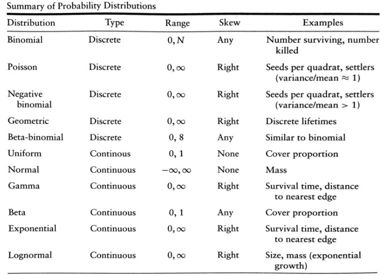

<br> 

## Workshop description

Here, we will cover how to run linear models (LMs; e.g., Gaussian/Normal distribution), generalized linear models (GLMs; e.g., binomial, Poisson for count data), and mixed models (LMMs/GLMMs; e.g., fixed vs. random effects). We will also expand on models using Poisson-distributed data by evaluating how to deal with common issues such as when your count data are over-dispersed/under-dispersed (e.g., Poisson vs. Negative Binomial vs. Conway-Maxwell-Poisson), when counts should be represented as rates (e.g., counts per unit time using Poisson offsets), and when your count data are zero-inflated (e.g., 0-inflated regression vs hurdle models). Finally, we will finish the session on appropriate ways to run model selection techniques for finding a winning model from a set of candidate models, using Akaike Information Criteria (AIC) or likelihood ratio tests (LRT) for nested models. This course will not be a statistics course, so people will need to be familiar with most of these models.

<br>

## Packages required

Before running the following code, please open the R Project for the EntSoc R Webinar series in the main folder ("EntSoc_R-Webinar_2020.Rproj"). 

Here, is a list of packages required for this R course. You will need to install these prior to the class, either install from the "packages" panel in R studio or using the function below. 

> install.package("")

Once installed, we can run these packages in advance. I will inform you whenever we are running a function from each of these packages throughout this session. 

```{r Packages required, message=F, warning=F }

library(here) # for navigation among folders
library(tidyverse) # for all tidyverse packages

library(pscl) # for zero-inflated regression models 
library(glmmTMB) # for both zero-inflated and hurdle models
library(lme4) # for mixed models

library(boot) # testing assumptions of the Gamma distribution
library(car) # for likelihood ratio tests/marginal hypothesis testing
library(lmtest) # for likelihood ratio tests
library(bbmle) # for AIC

```

<br> 

## Workshop topics

Today, we will cover six main topics in this workshop: 

   1. Linear models 
   2. Model selection approaches
   3. Generalized linear models
   4. Common issues with Poisson-distributed data
   5. Mixed models
   6. Intro to simulating data

We will cover alternative statistical distributions to the Normal and Poisson distributions, when encountering common issues with these data. 

For background reading that is required for this course, I would highly recommend reading:

* "Ecological models and data in R" by *Ben Bolker*
* "Model Selection and Inference: A Practical Information-Theoretic Approach" by *Kenneth Burnham* and *David Anderson*  
* Some of the first chapters (1-6) of "Program MARK: A Gentle Introduction" by *Gary White* and *Evan Cooch* that provides a good introduction to probability and maximum likelihood estimation.

I have listed some other useful resources at the end of this rmarkdown file. Not always one way of describing something will make sense to you, so often it takes finding the right teacher or resource for these concepts to click. 

<br>

### 1. Intro to linear models

First, we will cover running linear models (LMs) for data that follows a normal (or Gaussian) distribution. Linear models can be used to carry out:

* Single stratum analysis of variance (i.e., intercept-only models)
* Analysis of variance (ANOVA, i.e., differences among groups)
* Regression
* Analysis of covariance (ANCOVA) 

... that we will cover today. For these models, we will use Brown hare (*Lepus europaeus*) data over 17 years (1992-2008) at 56 sites in 8 regions of Switzerland for many of our examples today. These sites vary in area, elevation, and belong to two habitat types (arable and grassland). Mean density is the count1 of hares offset by the area of the site (i.e., mean.density = count1/area). These data are used in the [2010 Marc Kery book](https://www.mbr-pwrc.usgs.gov/software/kerybook/) that contains examples of both R and WinBUGS code.  

```{r Hares data, include = T }

hares <- read.table(here::here("Session 2", "Data", "hares.txt"), header = T)
head(hares)

```

<br>

#### Intercept-only models 

First, we will run a single stratum analysis of variance (aka "intercept-only") model to estimate the mean density of Brown hares across Switzerland.  

```{r Intercept-only model }

dens1 <- lm(mean.density ~ 1, data = hares)
summary(dens1)

```
  
Interpreting the summary output:    
  
* *Call:* model formula.
* *Residuals:* difference between the observed response values and model predicted values. Mean should be zero.  
* *Coefficients:* 
  + Model estimate
  + SE of model estimate
  + t-value (SDs our estimate is from 0)  
  + P-value (i.e., probability of observing a value equal or larger than *t*, i.e., is our model estimate is significantly different from 0?)
* *Residual Standard Error:* average amount that the response will deviate from our model estimate.  

```{r Interpreting the lm() summary output - part 1 }

mean(dens1$residuals) # mean of the residuals is close to zero

mean(hares$mean.density, na.rm = T) # Mean
sd(hares$mean.density, na.rm = T)/sqrt(nrow(subset(hares, !is.na(mean.density)))) # SE = sd/sqrt(n)

summary(dens1)$sigma / summary(dens1)$coefficient[1] # 80% percentage error 

```

<br>

#### One-way ANOVA

Next, we will run a one-way analysis of variance (ANOVA) model to estimate mean density of brown hares in the two habitat types: arable vs. grassland. 

```{r One-way ANOVA }

dens2 <- lm(mean.density ~ landuse, data = hares)
summary(dens2)

```

The lm() summary also contains three more outputs:   
  
* *Multiple R-squared:* determines how well your model fits your data (aka the coefficient of determination).
* *Adjusted R-squared:* provides the same information, but adjusts the multiple R-squared value by the number of variables in your model.   
* *F-statistic:* checks that at least one of your coefficients in your model is nonzero.   

```{r Interpreting the lm() summary output - part 2 }

summary(dens2)$r.squared # only 6.3% of landuse explains the variance in mean density

TSS <- sum((hares$mean.density-mean(hares$mean.density, na.rm = T))^2, na.rm = T) # total sum squares
RSS <- sum(dens2$residuals^2) # residual sum squares (difference between y values and the two means)
(TSS-RSS)/TSS # r-squared

```

For this model, we used what is referred to as "effect parameterization". The dummy variable (or *Intercept*, $\beta_{0}$) is arable land, and the *landusegrass* is difference to grassland relative to the dummy variable (or *slope*, $\beta_{1}$). 

```{r Dummy variable }

coef(dens2) # Intercept (i.e., arable estimate) and slope (i.e., difference between arable and grassland)

```

The mean density in the arable land is `r coef(dens2)[1]` and the mean density in the grassland is `r coef(dens2)[1] + coef(dens2)[2]`, i.e., $y = \beta_{0} + \beta_{1} x$ where *x* is either "1" for grassland or "0" for arable.  

$$ y = \beta_{0} + \beta_{1} x $$

```{r Effects parametrization }

subset(hares, !is.na(mean.density))[70:80,]
model.matrix(dens2)[70:80,]  # each row is an observation used to find MLE for landuse

effects_par <- lm(mean.density ~ 1 + landuse, data = hares) 
summary(effects_par)$coefficients # same model as dens2, formula assumes "~ 1 +" 

```

However, we can also use the "means parameterization" approach for our model structure, where each group is *not* in reference to the "dummy" variable.  

```{r Means parameterization }

means_par <- lm(mean.density ~ -1 + landuse, data = hares) # removes dummy variable
summary(means_par)$coefficients 

model.matrix(effects_par)[70:80,]  # each row is an observation used to find MLE 
model.matrix(means_par)[70:80, ]

```

<br> 

**Practice example 1:** We will be using the built-in "ToothGrowth" R dataset. These data from an experiment studying the effect of vitamin C on tooth growth in 60 Guinea pigs. Each animal received one of three dose levels of vitamin C (0.5, 1, and 2 mg/day) by one of two delivery methods: orange juice (OJ) or ascorbic acid (VC).    

> ?ToothGrowth

```{r Upload ToothGrowth dataset }

attach(ToothGrowth) 
head(ToothGrowth)

```

With these data, run an ANOVA to estimate tooth growth for the three dosages of vitamin C. Run two models using the effects and means parameterization approach. 

```{r Practice 1 - one-way ANOVA }


```

*Hint:* you may want to use str() to look at the structure of the dataset.

<br>

#### Two-way ANOVA

Here, we will run a two-way ANOVA *without an interactive effect* of both landuse and region on mean density of Brown hares. 

```{r Two-way ANOVA without interaction }

dens4 <- lm(mean.density ~ region + landuse, data = hares)
coef(dens4)

dens5 <- lm(mean.density ~ -1 + region + landuse, data = hares)
coef(dens5) # mildly more comprehensible 

```

By removing the dummy variable for region ("dens5"), we can see that each region has an estimate for mean density of brown hares in arable land. To obtain a grassland estimate for each region, you will still need to add landusegrass: `rcoef(dens5)[9]` to each region estimate.   

```{r Calculation of model estimates }

coef(dens5)[1:8] # estimate for arable land for all regions
coef(dens5)[1:8] + coef(dens5)[9] # estimate for grassland for all regions

```

Next, we will run a two-way ANOVA *with interactive effects* of both vitamin C dosage and supplement type on tooth growth in guinea pigs.  

```{r Two-way ANOVA with interaction }

grow1 <- lm(len ~ supp + factor(dose) + supp:factor(dose), data = ToothGrowth)
coef(grow1)

grow2 <- lm(len ~ supp * factor(dose), data = ToothGrowth) # same model as grow1 
coef(grow2)

```

<br>

**Practice example 2:** For this practice example, we will be using the data are from [Lampe et al. 2013](https://doi.org/10.1111/1365-2435.12215). Grasshopper nymphs were relocated from seven roadside (n = 112) and five non-roadside (n = 65) habitats (i.e., "Origin") to a laboratory. Half from each habitat were reared in either noisy or quiet conditions (i.e., "Treatment") for a full two-by-two factorial design. Then, the adult males were weighed (i.e., "BodyMass") and their courtship songs (i.e., "LocMax") recorded. 

```{r Grasshopper song dataset }

ghp <- read.csv(here::here("Session 2", "Data", "GrasshopperSong.csv"))
head(ghp) 

```

Using the grasshopper song data, run a two-way ANOVA looking at the effects of origin population (i.e., non-roadside or roadside) and rearing treatment (i.e., noisy vs quiet) on male Bow-winged grasshopper song. 

```{r Practice 2 - Two way ANOVA }


```

<br>

#### Simple linear regression

A simple linear regression is an approach for modelling the relationship between a single continuous predictor variable $x_{i}$ on a continuous response variable $y_{i}$, as follows: 

$$ y_{i} = \beta_{0} + \beta_{1}x_{i} $$
where the model describes a line with some intercept $\beta_{0}$ and y-intercept $\beta_{1}, such that the linear function provides a "best-fitting" line between the two variables. 

Here, we will use the built-in dataset from an experiment evaluating the effects of diet on early growth of chicks to run a simple linear regression. Chicks were given one of four diets and weighed each day since birth ("Time") for approximately 21 days. 

```{r Linear regression }

cw1 <- lm(weight ~ Time, data = ChickWeight)
summary(cw1)

pred.lin <- coef(cw1)[1] + coef(cw1)[2]*0:21
with(ChickWeight, plot(Time, weight, xlab = "Days since birth"))
points(0:21, pred.lin, type = "l", col = "blue")

```

We can also run *n*-degree polynomial linear functions. I have choosen to only run a second-degree polynomial relationship (e.g., quadratic function) to evaluate whether there is an intermediate elevation that has the highest mean density of brown hares.  

```{r Polynomial relationship }

cw2 <- lm(weight ~ Time + I(Time*Time), data = ChickWeight)
summary(cw2)

pred.quad <- coef(cw2)[1] + coef(cw2)[2]*0:21 + coef(cw2)[3]*0:21*0:21
with(ChickWeight, plot(Time, weight, xlab = "Days since birth"))
points(0:21, pred.quad, type = "l", col = "red") # quadratic function
points(0:21, pred.lin, type = "l", col = "blue") # linear function

```

Note that we need to use the function *I()* for the quadratic term, which treats the variable "as is" rather than an interaction between two variables (as seen in the two-way ANOVA with an interaction). 

<br>

**Practice example 3:** Using the built-in "ToothGrowth" R dataset, run linear regression to determine whether tooth growth changes linearly with vitamin C dosage. Then, plot the raw data and model predicted values. 

```{r Practice 3 - Regression }


```

<br>

#### ANCOVA

An analysis of covariance (ANCOVA) combines both categorical (e.g., ANOVA) and continuous (e.g., linear regression) covariates to predict some response variable. 

Using the ChickWeight dataset, we will run an ANCOVA to evaluate the interactive effects of diet and time on chick weights.

```{r ANCOVA }

cw3 <- lm(weight ~ factor(Diet)*Time, data = ChickWeight)
coef(cw3)

chick.dat <- data.frame(expand.grid(Time = 0:21, Diet = factor(c(1:4))))
chick.dat$pred <- predict(cw3, newdata = chick.dat, type = "response") # use the predict() function
head(chick.dat)

ggplot(ChickWeight, aes(x = Time, y = weight, col = factor(Diet))) + geom_point() +
  geom_line(chick.dat, mapping = aes(x = Time, y = pred, col = factor(Diet)))

```

<br>

**Practice example 4:** Using the built-in data on ToothGrowth, run an ANCOVA to evaluate the interactive effects of supplement type and dose on chick weights. Then, plot these data. 

```{r Practice 4 - ANCOVA }


```

<br>

#### Assumptions of normality

Before continuing with this statistical distribution, we always want to test for the assumptions of normality on our response variable. A linear regression has four assumptions:

  1. *Linearity of the data:* linear relationship between *x* and *y*. (residuals vs fitted values)
  2. *Normality of residuals:* residual errors are normally-distributed. (QQ plot)
  3. *Homogeneity of residuals variance (i.e., homoscedasticity):* constant variance of the residuals. (scale-location plot)
  4. *Independence of residuals error terms:* depends on what may be dependent on your residuals. 

We can test for relevant assumptions using diagnostic plots:

```{r Diagnostic plots }

hares$yearPost <- hares$year - 1991 # rescale year to converge on an estimate, scale(year) also works
dens6 <- lm(mean.density ~ yearPost, data = hares)

plot(dens6, 1) # Residuals vs fitted - red line is flat meaning linear relationsip
plot(dens6, 2) # QQ plot - examine whether residuals are normally-distributed
plot(dens6, 3) # Scale-location - homogeneity of variance of residuals (homoscedasticity) if horizontal line with equal spread
plot(dens6, 4) # Cook's distance - identify extreme values and their obs. number
plot(dens6, 5) # Residuals vs leverage - for identifying influential cases or extreme values

hist(hares$mean.density) # left-skewed

```

It is difficult to do a general test for dependence of the residual error term. You will need to know why your residual error term may be dependent: either residuals can correlate with another variable (e.g., check residuals-fitted plot) or residuals can correlate with a nearby residual (e.g., autocorrelation in time series data).

```{r Independence of residual error terms - time series }

LI04.grass <- subset(hares, site == "BE12" & !is.na(mean.density))
acf(LI04.grass$mean.density)

LU01.grass <- subset(hares, site == "GE02" & !is.na(mean.density))
acf(LU01.grass$mean.density)

```

Our residual error terms seem to be independent, particularly from temporal autocorrelation. Regardless, our data do not meet all the assumptions of a linear regression (i.e., normality of residuals since data are negatively (left) skewed and bound by 0 to $\infty$). 

First, we can use the most common approach when our data do not met the assumptions of normality, which is to transform our response variable, *y*. There are many ways to transform your data (e.g., log, square-root, arcsine). However, we will only cover the log transformation of our response variable, *y* (i.e., log(*y*) is normal given *x*):

$$ ln(y_{i}) = \beta_{0} + \beta_{1}x_{i} $$

```{r Data transformation }

dens7 <- lm(log(mean.density) ~ yearPost, data = hares)

plot(dens7, 1) # linear relationship between x and y (good)
plot(dens7, 2) # residuals are not normality-distributed, mild right-skew (ok)
plot(dens7, 3) # mild constant variance of the residuals (ok)

hist(hares$mean.density) # negatively/left skewed
hist(log(hares$mean.density)) # slightly positively/right skewed

```

Instead of transforming our response to fit a statistical distribution (i.e., log(*y*) is normal given *x*), we can choose a statistical distribution that fits our data. First, we might want to try the log-link Gaussian distribution (i.e., mean of log(*y*) responses linearly to *x*), such that:

$$ln(\mu) = \beta_{0} + \beta_{1}x $$

```{r Log-link Gaussian }

dens8 <- glm(mean.density ~ yearPost, family = gaussian(link = "log"), data = hares) # glm() instead of lm()

plot(dens8, 1) # relationship between x and y seems linearly (good)
plot(dens8, 2) # residuals are not normality-distributed, left-skewed (bad)
plot(dens8, 3) # constant variance of the residuals (ok)

```

Compared to log-transformation of the *y* values, the log-link Gaussian does not seem to perform better when checking the assumptions of a linear regression. 

We could also use the Gamma distribution that allows for non-negative, skewed, continuous data that are bound by 0 to infinity. The Gamma distribution (either log Gamma or inverse Gamma) assumes heavier tailed/skewed distribution, particularly the inverse Gamma distribution. 

```{r Log-link Gamma distribution }

dens9 <- glm(mean.density ~ yearPost, family = Gamma(link = "log"), data = hares)

gamma.diag <- boot::glm.diag(dens9) 
boot::glm.diag.plots(dens9, gamma.diag)

```

The plot(dens9) does not provide the correct diagnostic plots for the Gamma distribution. The "boot" package allows us to assess the relevant assumptions for the Gamma distribution. The Gamma distribution (or any distribution with a scale term) does not need to worry about heteroscedasticity.

<br>

**Practice example 5:** Test the assumptions of normality for the simple linear regression model that was run in code chunk #17. Then, re-run the model with a Gamma distribution and evaluate the assumptions.

> cw1 <- lm(weight ~ Time, data = ChickWeight)

```{r Practice 5 - Testing assumptions of linear regression }


```

<br>

### 2. Model selection 

Here, I will outline the general procedure for model selection in two parts: selecting the appropriate probability distribution and selecting variables in your model. 

<br>

#### Select the probability distribution

  a. Based on first principles  

{width = 100%} 

<br>

  b. Based on analysis of data  
   
We could also select the appropriate probability distribution from analyzing our data. To recap, we ran four models to evaluate whether mean density of brown hares changes linearly with year. We can use Akaike Information Criteria (AIC) to rank our candidate models:

$$ AIC = 2k - 2LL $$
where *k* is the number of parameters in the model and *LL* is the log likelihood of the model. AIC decreases with increasing model fit (*LL*) but penalizes for the number of parameters. The lower the AIC, the better the model. Here, we can use the `ICtab` function from the `bbmle` package.

```{r Analysis of data - hares }

# from testing our assumptions
dens7 <- lm(mean.density ~ yearPost, data = hares)
dens8 <- lm(log(mean.density) ~ yearPost, data = hares) 
dens9 <- glm(mean.density ~ yearPost, family = gaussian(link = "log"), data = hares)
dens10 <- glm(mean.density ~ yearPost, family = Gamma(link = "log"), data = hares)

ICtab(dens7, dens8, dens9, dens10, base = T) # log transformation wins

# from practice 5
cw1 <- lm(weight ~ Time, data = ChickWeight)
cw1_lg <- glm(weight ~ Time, family = Gamma(link = "log"), data = ChickWeight)

ICtab(cw1, cw1_lg) # gamma wins

```

The common rule would be to choose the most parsimonious model within 2 dAIC of the winning model. 

**Note:** If multiple models fall witin 2 dAIC of the winning model, you can choose to do something referred to as "model averaging". Model averaging is not ideal for model with different probability distributions. It would be better for averaging multiple winning models, such a linear and quadratic function since the model falls somewhere between those functions. The *bbmle::ICtab()* function has an argument for computing IC weights that allows for model averaging. For more information on model averaging, see Anderson and Burham 2002. 

<br>

#### Selecting variables

For selecting variables in your model, you can do model selection in two ways: Akaike Information Criteria (AIC) for competing models or likelihood ratio test (LRT) of nested models. 
  
  a. AIC analyses of competing models

We can also use AIC values to select a winning model based on a set of candidate models with different covariates. 

Here, we are using epidemiological data from [Vicente et al. 2006](https://doi.org/10.1051/vetres:2005044) that took parasite loads in red deer reared on a number of estates in Spain. Observations on red deer were taken at different farms, months, year (0-5 are 2000-2005, 99 is 1999), and sexes (1 - Male, 2 - Female). For each observation, the length of the animal (LCT, length of head-body), kidney-fat index (KFI), the number of *Elaphostrongylus cervi* parasites (Ecervi) per grams of wet feces, and the presence (0, 1) of Tuberculosis were taken. 
  
Here, we might evaluate whether infection intensity of *Elaphostrongylus cervi* parasites in red deer correlated better with length of the animal (LCT) or kidney fat index (KFI). 

```{r AIC of competing models }

deer <- read.table(here::here("Session 2", "Data", "Deer.txt"), header = T)

hist(deer$Ecervi)
hist(log(deer$Ecervi))

ec1 <- lm(log(Ecervi + 0.01) ~ KFI, data = deer)
ec2 <- lm(log(Ecervi + 0.01) ~ LCT, data = deer)

ICtab(ec1, ec2) # KFI is better than LCT at explaining parasite load

```

<br>

  b. LRT and "marginal hypothesis testing" of a saturated model. 

For nested models, we should use "marginal null hypothesis testing" of a saturated model to determine significant effects of nested terms. 

For example, we might want to evaluate whether Taylor Checkerspot caterpillars reared on two host plant (i.e., Indian paintbrush and English Plantain) that were either sprayed or not sprayed with herbicide treatment affected their mass.  

```{r LRT }

herb <- read.csv(here::here("Session 2", "Data", "HerbicideCaterpillars.csv"))
head(herb)

hist(herb$Mass)
sat_mod <- glm(Mass ~ Host + Treat + Host:Treat, family=gaussian, data = herb) 
car::Anova(sat_mod)

add_mod <- glm(Mass ~ Host + Treat, family=gaussian, data = herb) 
host_mod <- glm(Mass ~ Host, family=gaussian, data = herb)
treat_mod <- glm(Mass ~ Treat, family=gaussian, data = herb) 

lmtest::lrtest(add_mod, sat_mod)
lrtest(host_mod, add_mod)
lrtest(treat_mod, add_mod)

```

<br>

### 3. Intro to generalized linear models

Generalized linear models (GLMs) connect a mean of the response to its predictors in a linear way through *link functions*. Therefore, it produces coefficients of a linear relationship on the link function scale. Instead of transforming data to fit a normal distribution, such as the log transformation:
 
$$ln(y_{i}) = \beta_{0} + \beta_{1}x_{i} $$
 

$$\mu_{ln(y)} = \beta_{0} + \beta_{1}x_{1} $$

GLMs allows data to follow alternative error distributions, such as a Poisson error distribution on a natural log link function scale:   

$$ln(\mu_{y}) = \beta_{0} + \beta_{1}x_{1} $$

<br>

#### Binomial distribution

Before explaining the Binomial distribution, we should explain the Bernoulli distribution. The Bernoulli distribution describes the probability of getting a single event in a single trial (or a particular sequence of results in some number of trials), whereas the binomial distribution describes the probability of getting *k* events out of *N* unordered trials, if each trial has a Bernoulli distribution with probability *p* of an event. Therefore, a binomial distribution with only one trial is a Bernoulli distribution.

* **Bernouli trial** - if we tossed a coin six times and we got five heads, we could represent this as one trial where we got 4 successes and 2 failures, where the probability of getting heads is 0.67 (=4/6). The number of trials *N* is 1.
* **Binomial trial** - if we tossed a coin six times, we got heads (1), tails (0), heads (1), heads (1), tails (0), and heads (1). If each toss was treated as an independent Bernoulli trial, the number of trials *N* is 6 and the *k* events is 4. 

Below, we will use generalized linear models to estimate a response that is binomially-distributed. A binomial response can either be at the individual-level (i.e., presence/absence where each "0" or "1" is an independent Bernoulli trial) or at the group-level (e.g., *k* events and *N* trials).  

<br>

**Individual-level response** 

For our first example, we will be using data from a laboratory diapause experiment to estimate the probability of entering diapause as a function of photoperiod. Mustard white butterfly (*Pieris oleracea*) larvae were reared in five photoperiod treatments, then I reported whether each individual had survived (1 for survival, 0 for died) and whether they diapaused (1 for entering diapause, 0 for eclosing) conditioned on surviving. These data were used in [Kerr et al. 2020](https://doi.org/10.1111/gcb.14959).  

```{r Mustard white data }

diap <- read.csv(here::here("Session 2", "Data", "MW_DiapausingExp.csv"))
head(diap)

```

We can run a logit-link GLM to estimate the probability of diapausing conditioned on survival as a function of photoperiod, as follows: 

```{r Individual-level binary response - Presence/absence }

pd1 <- glm(Diapause ~ Treatment, family = binomial, data = subset(diap, Sex == "female"))
Anova(pd1)

summary(pd1)

light.vals <- seq(min(diap$Treatment), max(diap$Treatment), length.out = 50)
pd.logit <- coef(pd1)[1] + coef(pd1)[2]*light.vals # logit-link scale estimates
pd.pred <- plogis(coef(pd1)[1] + coef(pd1)[2]*light.vals) # back-transformed estimates

plot(light.vals, pd.logit, type = "l", ylab = "Diapause probability on the logit-link scale", xlab = "Photoperiod")
plot(light.vals, pd.pred, type = "l", ylab = "Diapause probability", xlab = "Photoperiod")

manual.pred <- exp(coef(pd1)[1] + coef(pd1)[2]*light.vals) / (1 + exp(coef(pd1)[1] + coef(pd1)[2]*light.vals))
tail(pd.pred)
tail(manual.pred)

```

First, the summary output includes two more outputs for a GLM: 
* *Null deviance:* is the 2(LL(Saturated Model) - LL(Null Model)), where the saturated model assumes each data point has its own parameter (*n* parameters) and the null assumes one parameter for all data (1 parameter).
* *Residual deviance:* is the 2(LL(Saturated Model - LL(Proposed Model)) and refers the goodness-of-fit of the proposed model, where your data can be explained by *p* parameters and an intercept term. 

To compare your null with the proposed, you can calculate the chi-squared value $\chi^2 = null deviance - residual deviance$ and the degrees of freedom $df Proposed - df Null$.

<br>

**Group-level response** 

For our second example, we will be using data from an overwintering experiment to estimate the overwinter survival of diapausing pupa of the mustard white butterfly. Each bug dorm had a fall count of diapausing pupa (*N*, trials) and a spring count of the number of emerging butterflies (*k*, events). In other words, we evaluate the number of success as the number of emerging butterflies (i.e., *k*) and the number of failures as the number of non-emerging butterflies (i.e., *N - k*).

We can run an intercept-only logit-link GLM to estimate the overwinter survival of the mustard white butterfly, as follows: 

```{r Group-level binary response - k/N }

surv <- read.csv(here::here("Session 2", "Data", "MW_OverwinterSurv.csv"))
head(surv)

ws1 <- glm(cbind(Spring.count, Fall.count - Spring.count) ~ 1, family = binomial, data = surv)
summary(ws1)  

plogis(coef(ws1)) # 13% probability of surviving the winter
exp(coef(ws1)) / (1 + exp(coef(ws1)))

```

I think the group-level binary response has many potential applications:

For example, I have used it to estimate the trap color of Venus flytraps based on crude categorization of color along a spectrum from green to dark red. 

 

The colors of traps were one of seven categories ranging from green, green-pink, pink, pink-red, red, red-dark red, and dark red. The total number of trials was 6, where green was 0 successes + 6 failures and dark red was 6 successes + 0 failures. 

The following are three Bernoulli trials for three plants: 
> cbind(0, 6) # green
> cbind(3, 3) # pink-red
> cbind(6, 0) # dark red

 

Another example could be estimating the day of spring emergence for a diapausing insect, where *N* trials is the 365 days of a year (assuming not a leap year) and *k* events is the number of days into the year when it emerged. In other words, the number of successes would be days from January 1st that it took to emerge and the number of failures would be the remaining days of the year. Then, you would get some probability (into the year) that an insect would emerge from diapause. You could multiple that probability estimate by the number of days in a year to convert back into "days until spring emergence". 

This binary "group-level" format has many potential ecological applications. 
 
<br>

**Practice example 6:** Using the deer data, run a logit-link GLM to estimate the probability that a red deer will have the parasite *Elaphostrongylus cervi* given its kidney fat index (KFI) and sex. Run marginal hypothesis testing to evaluate the interactive effects of these two covariates. 

```{r Practice 6 - Probability of infection }


```

<br>

#### Poisson distribution

Here, we will be exploring running log-link GLMs using the Poisson error distribution. In simple terms, the Poisson distribution is used for discrete count data that are bound by 0 to $\infty$.

In more complex terms, the Poisson distribution is like the binomial distribution in that it has a large "unknown" number of trials *N* and a small probability of an event $p = \lambda / N$, where $\lamdba$ is the *k* discrete events (or mean count estimate). The probability of given number of events can be thought of as the probability of counting an individual that occurs over a fixed interval of time or space.

Here, we have counts of wolves in each year from 1982 to 2012 across five US states.   

```{r Wolves data }

wolves <- read.csv(here::here("Session 2", "Data", "NRMwolves.csv"))
head(wolves)

```

First, we will run a Poisson GLM to evaluate whether the total number of wolves has changed over a 10-year period from 1994-2003. 

```{r Number of Wolves - 10 years }

with(wolves[13:22,], plot(year, num.wolves))

wv10a <- glm(num.wolves ~ year, family = poisson(link = "identity"), data = wolves[13:22,])
coef(wv10a) # year is the change in the # of wolves per year 

wv10b <- glm(num.wolves ~ year, family = poisson(link = "log"), data = wolves[13:22,])
coef(wv10b)
exp(coef(wv10b)[2]) # slope is the population growth rate

wolves$num.wolves[13] # number of wolves in 1994
exp(coef(wv10b)[2]) * wolves$num.wolves[14] # estimated number of wolves in 1995

with(wolves[13:22,], plot(year, num.wolves))
points(1994:2003, coef(wv10a)[1] + coef(wv10a)[2]*1994:2003, type = "l", col = "blue") # linear growth
points(1994:2003, exp(coef(wv10b)[1] + coef(wv10b)[2]*1994:2003), type = "l", col = "red") # unlimited expontential growth 

```

Second, we will evaluate whether the total number of wolves has changed over the full 30-year period from 1983 to 2012. 

```{r Number of Wolves - 30 years }

with(wolves[2:31,], plot(year, num.wolves))

wv30a <- glm(num.wolves ~ year, family = poisson(link = "log"), data = wolves[2:31,]) # unlimited exp growth 
coef(wv30a) 

wv30b <- glm(num.wolves ~ year + I(year*year), family = poisson(link = "log"), data = wolves[2:31,]) # quadratic function model
coef(wv30b)

with(wolves[2:31,], plot(year, num.wolves))
points(1983:2012, exp(coef(wv30a)[1] + coef(wv30a)[2]*1983:2012), type = "l", col = "blue") 
points(1983:2012, exp(coef(wv30b)[1] + coef(wv30b)[2]*1983:2012 + coef(wv30b)[3]*1983:2012*1983:2012), type = "l", col = "red") 

```

<br>

**Practice example 7:** Using the "Bombus_eggs.rds" R object file, run a Poisson GLM to estimate the number of new eggs laid (in bumblebee colonies, *Bombus vosnesenskii*) as a function of days of the experiment ("Days"). Evaluate whether a model with a linear or quadratic function better fits these data. Then, plot the raw data with model predicted values from both models.  

> readRDS() # for loading R object files

```{r Practice 7 - Poisson distribution }


```

<br>

### 4. Common issues with count data

Here, we will cover how to deal with three common issues that you may encounter with Poisson-distributed data: 

  1. When counts should be represented as rates
  2. When count data are over- or under-dispersed for the Poisson distribution variance
  3. When count data are zero-inflated

<br>

#### ... when counts should be rates 

A common issue in ecology is when each observation of count data are not always equally in represented in space or time. For example, you may find yourself in a situation where each observation is collected over different lengths of time or space. 

Here, we will use the [Audubon Christmas bird count](www.christmasbirdcount.org) 2013 data on Northern Flickers across New England. Since observation periods differ, we want to model our counts are rates (# per hour of observation).

```{r Poisson offsets - flickers }

flickers <- read.csv(here::here("Session 2", "Data", "NE_flickers.csv"))
head(flickers)

nf1 <- glm(Count ~ 1, family = poisson, data = flickers)
nf1_offset <- glm(Count ~ 1, offset = log(hours), family = poisson, data = flickers)
ICtab(nf1, nf1_offset)

exp(coef(nf1_offset)) # 0.07 birds per hour

```

Why "offset = log(hours)" in our model? Well, the Poisson offset can be represented algebraically as follows: 

$$ ln(counts/exposure) = \beta_{0} $$

which can be separated out as follows:

$$ ln(counts) - ln(exposure) = \beta_{0} $$ 

To estimate counts, the formula can be rearranged as follows: 

$$ ln(counts)  = \beta_{0} + ln(exposure) $$

We can also use offsets for running a process error model for evaluating population dynamics, where the counts in the current time step are offset by the previous time step. Therefore, you get an estimated growth rate for each time step of the series. 

```{r Poisson offsets - wolves for process error model }

wv30a <- glm(num.wolves ~ year, 
             family = poisson(link = "log"), data = wolves[2:31,]) # unlimited exp growth (observation error model)

x = 1:30
est.vals <- wolves$num.wolves[2]
for(i in 2:30){ 
  est.vals[i] <- wolves$num.wolves[i-1] * exp(coef(wv30a)[2])^x # simple discrete exp growth, N(t+x) = N(t) * r^x
}
est.vals 

wv30b <- glm(num.wolves ~ year + I(year*year), 
             family = poisson(link = "log"), data = wolves[2:31,]) # quadratic function model

wv30c <- glm(num.wolves[2:31] ~ 1, offset = log(num.wolves[1:30]), 
             family = poisson(link = "log"), data = wolves) # process error model
exp(coef(wv30c)) # growth rate from each time step
wolves$num.wolves[2:31] * exp(coef(wv30c))   

with(wolves[2:31,], plot(year, num.wolves, ylim = c(0, 2000)))
points(1983:2012, exp(coef(wv30a)[1] + coef(wv30a)[2]*1983:2012), type = "l", col = "blue") # observation error
points(1983:2012, exp(coef(wv30b)[1] + coef(wv30b)[2]*1983:2012 + coef(wv30b)[3]*1983:2012*1983:2012), type = "l", col = "red")
points(1983:2012, predict(wv30c, type = "response"), type = "l", col = "green") # process error

ICtab(wv30a, wv30b, wv30c) # quadratic model wins

```

<br> 

**Practice example 8:** Similarly, we could also model the brown hare counts *per area* as a Poisson offset instead of log(mean.density) using the normal distribution. Do you find similar estimates for mean density for the two landuse types when using Poisson distribution compared to log-transformed data?

```{r Example 8 - Poisson offsets }


```

<br>

#### ... when data are over-dispersed 

A common issue when fitting Poisson models is overdispersion, i.e., when count data has more variability than expected for a Poisson distribution. For Poisson models, data are less likely to be underdispersed for this given distribution. However, this is still likely to happen for biological data.  

To test for overdispersion, the residual deviance should be equal to the degrees of freedom. In other words, the ratio of residual deviance/degrees of freedom should be equal to 1. If the ratio is greater than 1, then your data is more dispersed than the Poisson error distribution permits. If the ratio is less than 1, then your data are less dispersed than the Poisson error distribution.  

Let's test whether Northern Flicker counts are overdispersed, using the "intercept-only" model from the Poisson offset example #1. 

```{r Testing for overdispersion - flickers }

nf1_offset <- glm(Count ~ 1, offset = log(hours), family = poisson, data = flickers) # model above
summary(nf1_offset)

nf1_offset$deviance/nf1_offset$df.residual # overdispersed

```

Let's test whether hare counts using Poisson offset model was overdispersed. 

```{r Testing for overdispersion - brown hares }

dens12 <- glm(count1 ~ 1, offset = log(area), family = poisson, data = hares) # model above
summary(dens12)

dens12$deviance/dens12$df.residual

```

In both cases, these data are overdispersed for the Poisson distribution. 

There are multiple ways to deal with overdispersed count data: 

* Negative binomial distribution (family = nbinom1 or nbinom2)
* Conway-Maxwell-Poisson distribution (family = compois)
* [Observation-level random effects](https://peerj.com/articles/616/)

Here, we will use the negative binomial distribution, which is the most common approach for overdispersion. A negative binomial distribution is essentially the average of different Poisson distributions with different means. Unlike the Poisson distribution where the mean is equal to the limits, the variance of the negative binomial can be either linear ("nbinom1") or quaratic ("nbinom2") parameterization of the mean. Therefore, a negative binomial mean closer to its limit -> $\infty$ will resemble a Poisson distribution. But closer to the bound of 0, it allows for greater variance in relation to its mean.  

Let's re-run the intercept-only Poisson offset model for Northern Flicker counts using a negative binomial distribution using `glmmTMB` function in the `glmmTMB` package by Ben Bolker.

```{r Negative binomial distribution - flickers }

nf2 <- glmmTMB(Count ~ 1, offset = log(hours), family = nbinom1, data = flickers)
nf3 <- glmmTMB(Count ~ 1, offset = log(hours), family = nbinom2, data = flickers)
ICtab(nf2, nf3) # variance is linearly parameterized to its mean

summary(nf1_offset)$coefficients # Poisson variance
summary(nf2)$coefficients$cond # NB allows for greater variance

```

<br>

#### ... when data are under-dispersed 

Undispersion is far less common than overdispersion, but it can be often encountered in ecology with species that have small clutch/litter sizes. For example, when a bird may only lay up to 6 eggs per clutch.

Here, we have a dataset on begging behaviour of nestling barn owls that may have an example of underdispersed count data from package `glmmTMB`. 

>?Owls

Roulin and Bersier (2007) looked at nestlings’ response to the provisioning parent under two food treatments. Using microphones inside and a video camera outside the nests, studying vocal begging behaviour when the parents bring prey for 27 nests. We use ‘sibling negotiation,’ defined as the number of calls by the nestlings in the 30-second interval immediately prior to the arrival of a parent, divided by the number of nestlings. Data were collected between 21.30 hours and 05.30 hours on two consecutive nights. The variable ArrivalTime indicates the time at which a parent arrived at the perch with prey.  

Using these data, we want to estimate the brood size of barn owls and evaluate whether these data are underdispersed. 

```{r Testing for underdispersion - brood size of owls }

attach(Owls)
Owls.sum <- Owls %>% group_by(Nest) %>% distinct(BroodSize) 

hist(Owls.sum$BroodSize)
 
bs1 <- glm(BroodSize ~ 1, family = poisson, data = Owls.sum)
summary(bs1) # on the log-link scale
exp(coef(bs1)) # back-transformed scale, approximately 4 nestlings per nest

summary(bs1)$deviance/summary(bs1)$df.residual # underdispersed, < 1
  
```

To address underdispersed count data, the most appropriate distribution would be the Conway-Maxwell-Poisson distribution that adds a parameter to the Poisson distribution to account for either underdispersion or overdispersion.  

```{r Conway-Maxwell-Poisson (CMP) distribution }

bs2 <- glmmTMB(BroodSize ~ 1, family = compois, data = Owls.sum)
ICtab(bs1, bs2)

```

You can also use the "quasipoisson" distribution for underdispersed count data. 

<br>

**Practice example 9:** Using the bumblebee dataset from practice example #7, run a Poisson GLM for new eggs laid as a function of resource treatment and evaluate whether these data are underdispersed or overdispersed for a Poisson distribution. Then, re-run a model with an appropriate probability distribution and evaluate whether the covariate of Treatment improves model fit.  

```{r Practice 9 - Overdispersion/underdispersion }


```

<br>

#### ... when counts are zero-inflated

Here, we will run two different models when you encounter many zeros in your count data (i.e., zero-inflated count data). We can take two potential approaches: zero-inflated regression or hurdle model. The first assumes that not all zeros are "true" zeros and that some are part of the Poisson process. This can commonly occur due to observation error. For example, your count data may be number of butterflies seen, but you are not sure that not seeing an individual means that there were actually no individuals present. For the zero-inflated models, the binomial process may determine whether a location is actually suitable habitat and the count process may represent the quality of the suitable habitat. However, remember that a count of 0 may not necessarily mean that it is a not suitable habitat. 

A zero-inflated Poisson model is required for this process, since not all zeros are true. Therefore, a zeroinflated model evaluates the nonzero and zero process together by evaluating the probability that a zero comes from the main "nonzero" distribution vs. the binomial distribution (i.e., an excess zero). 

You can implement zero-inflated models using `zeroinfl` function in the `pscl` package. 

> pscl::zerinfl(formula = y ~ x_count | x_zero)

However, we will be using the 'glmmTMB' package to run both zero-inflated and hurdle models, since this package has additional probability distributions not in `pscl` and it also allows for both these models to have mixed-effects, which we will discuss later.

```{r ZIP using glmmTMB }

ZIP1 <- glmmTMB(Count ~ 1, offset = log(hours), ziformula = ~1, family = "nbinom1", data = flickers)
summary(ZIP1)
summary(ZIP1)$coefficients

ZIP2 <- glmmTMB(Count ~ 1, offset = log(hours), ziformula = ~Latitude, family = "nbinom1", data = flickers) # Same as ZiP2
lrtest(ZIP1, ZIP2) # significant effect of latitude on zero process
summary(ZIP2)$coefficients

ZiP3 <- glmmTMB(Count ~ Latitude, offset = log(hours), ziformula = ~., family = "nbinom1", data = flickers)
summary(ZiP3)$coefficients

```

For hurdle models, the nonzero and zero processes are modelled separately, and therefore, we assume all zeros are true zeros. 
The glmmTMB package also allows for hurdle models for count data using the "truncated_poisson" family. Note that use of the "poisson" family would indicate a zero-inflated model. Here, we are using the owl dataset that is included in glmmTMB package. 

```{r Hurdle models using glmmTMB }

table(Owls$SiblingNegotiation)

h_mod_pois <- glmmTMB(SiblingNegotiation ~ FoodTreatment, ziformula = ~FoodTreatment, 
                      family = truncated_poisson(link = "log"), data = Owls)
h_mod_nbin1 <- glmmTMB(SiblingNegotiation ~ FoodTreatment, ziformula = ~FoodTreatment, 
                      family = truncated_nbinom1(link = "log"), data = Owls)
h_mod_nbin2 <- glmmTMB(SiblingNegotiation ~ FoodTreatment, ziformula = ~FoodTreatment, 
                      family = truncated_nbinom2(link = "log"), data = Owls)
h_mod_compois <- glmmTMB(SiblingNegotiation ~ FoodTreatment, ziformula = ~FoodTreatment, 
                      family = truncated_nbinom2(link = "log"), data = Owls)
ICtab(h_mod_pois, h_mod_nbin1, h_mod_nbin2, h_mod_compois) # do we need to account for overdispersion?

summary(h_mod_nbin1)

```

For the deer data, let's assume that method for detecting *Elaphostrongylus cervi* parasites in red deer is very accurate and all zeros are true zeros. In other words, there are no potential false negatives (not detecting parasite, when it's present). Here, let's evaluate whether the probability of infection and the infection intensity (i.e., the number of parasites per gram of wet feces) is dependent on both kidney fat index (KFI).  

```{r Hurdle models using glm }

with(deer, hist(Ecervi)) # zero-inflated
deer$PEcervi <- deer$Ecervi
deer$PEcervi[deer$PEcervi > 0] <- 1

h_zero <- glm(PEcervi ~ Sex, family = binomial, data = deer)
Anova(h_zero)

h_nzero <- glm(log(Ecervi) ~ KFI, family = gaussian, data = subset(deer, PEcervi == 1))
Anova(h_nzero) # no interaction 

non_hurdle <- glm(log(Ecervi + 0.01) ~ Sex*KFI, family = gaussian, data = deer)
Anova(non_hurdle)

# Is the hurdle model better?
AIC(non_hurdle)
2*(length(coef(h_zero)) + length(coef(h_nzero))) - 2*(logLik(h_zero) + logLik(h_nzero)) # AIC = 2k - 2LL

```

<br>

**Practice example 10**: The Eastern bluebird data was also collected across New England from the [Audubon Christmas bird count](www.christmasbirdcount.org). Similar to the Northern Flickers, the Eastern Bluebirds have breeding grounds in the northern half of the United States, but all year grounds from Massachusetts down to Texas and exclusive wintering grounds in Texas and northern Mexico.

```{r Bluebird dataset }

bluebirds <- read.csv(here::here("Session 2", "Data", "bluebirds.csv"))
head(bluebirds)

```

Using the bluebirds data, choose whether a zeroinflated model, hurdle model, or GLM of bird counts with an offset of observation hours is more appropriate for these data. Include a covariate of both latitude on the zero (i.e., probability that it has migrated) process of the models. 

```{r Practice 10 - excess zeros }


```

<br>

### 5. Mixed models

Here, we evaluated models with only parameters with fixed or non-random effects (i.e., fixed group means). Fixed effects are generally the covariates of interest. Here, we will run models with covariates that evaluate both *fixed* and *random* effects called "**mixed models**" or "**mixed effects models**". These are a form of hierarchical models where the fixed effects are no longer assumed to be independent, but they come from a second distribution with some mean and variance of some "hyperparameter/s". For example, a simple fixed-effects ANOVA evaluating group means can be written as follows: 

$$ y_{i} = \alpha_{j(i)} + \epsilon_{i} $$  

where $\alpha_{j(i)}$ is the mean of response variable $y_{i}$ for population *j* and $\epsilon_{i}$ is the random deviance of *i* from its population mean $\alpha_{j(i)}$. The random deviance of $y_{i}$ from each group mean comes from a normal distribution:

$$ \epsilon_{i} \sim Normal (0, \sigma^2) $$

where the mean is 0 and the variance is $\sigma^2$ (remember that standard error of the mean estimate $\sigma$ is the square root of the variance).

For a random-effects ANOVA, the $\alpha_{j(i)}$ paramaters come from a second distribution with some mean $\mu$ and variance $\tao^2$:   

$$ \alpha_{j(i)} \sim Normal(\mu, \tau^2) $$

**NOTE:** a random-effects model rarely contains less than than five populations/groups, since estimating variance with sample size less than five will not result in very precise estimates. 

A common way to distinguish fixed from random effects is respectively based on what is the subject of interest vs some random "latent" variable that may result in greater variance in your model estimates but is *not* of interest. 

<br>

#### Random-coefficient models

Kery 2010 (CH 12) outlines four potential random-coefficient models: 

1. Only intercepts are random, but all slopes are identical for all "random" groups. 
2. Only slopes are random, but all intercepts are identical for all "random" groups. (*this model is not sensible model in most circumstances*)
3. Both intercepts and slopes are random, but they are independent. 
4. Both intercepts and slopes are random, and there is a correlation between them. 

Below, we will run all four combinations of random-coefficient models for the in-built dataset on Salamanders using `lme4::glmer()`. The Salamander dataset contains counts of salamander across sites that were either affected by mountain top coal mining ("mined"). The potential covariates of interest affecting counts are species of salamander ("spp"), cover objects in the stream ("cover"), days since precipitation (DOP), water temperature (Wtemp), and day of year (DOY).

```{r Salamander dataset }

attach(Salamanders)
head(Salamanders)

```

Our models will contain fixed effects of day of year (DOY) on the presence of salamanders. First, we will run a binomial GLM without any random effects. 

```{r No random effects }

Salamanders$Presence <- Salamanders$count
Salamanders$Presence[Salamanders$Presence > 1] <- 1

sm0 <- glm(Presence ~ DOY, family = binomial, data = Salamanders)
Anova(sm0)

```

First, we will run a random-intercept model (probably the most commonly used random-coefficient model) that allows the model estimate for the intercept to come from a second distribution that estimates a mean and variance from intercepts from each species. 

```{r Random-intercept model }

sm1 <- glmer(Presence ~ DOY + (1 | spp), family = binomial, data = Salamanders)
summary(sm1)

ranef(sm1)$spp

# Plotting each intercept
DOY.vals <- seq(min(Salamanders$DOY), max(Salamanders$DOY), length.out = 100)
re_list1 <- list()
for(i in 1:length(unique(Salamanders$spp))){
  re_list1[[i]] <- data.frame(spp = rep(unique(Salamanders$spp)[i], 100), DOY = DOY.vals, 
                              int = rep(ranef(sm1)$spp[i,1], 100), 
                              slope = rep(fixef(sm1)[2], 100))
}
re_dat1 <- do.call("rbind", re_list1)
re_dat1$pred <- plogis(re_dat1$int + re_dat1$slope*re_dat1$DOY) # y = B0 + B1x

re_mod1 <- data.frame(DOY = DOY.vals, pred = plogis(fixef(sm1)[1] + fixef(sm1)[2]*DOY.vals))
  
ggplot(re_dat1, aes(x = DOY, y = pred, col = spp)) + geom_line() +
  geom_line(re_mod1, mapping = aes(x = DOY, y = pred, col = NA), col = "black", size = 2) + 
  scale_y_continuous(limits = c(0, 1))

```

Second, we will run a random-slope model (note that this is often not a sensible model) that allows the model estimate for the slope only to come from a second distribution that estimates a mean and variance from slopes from each spp. 

```{r Random-slope model }

sm2 <- glmer(Presence ~ DOY + (0 + DOY | spp), family = binomial, data = Salamanders)
summary(sm2)

ranef(sm2)$spp

# Plotting each intercept
re_list2 <- list()
for(i in 1:length(unique(Salamanders$spp))){
  re_list2[[i]] <- data.frame(spp = rep(unique(Salamanders$spp)[i], 100), DOY = DOY.vals, 
                              int = rep(fixef(sm2)[1], 100), 
                              slope = rep(ranef(sm2)$spp[i,1], 100))
}

re_dat2 <- do.call("rbind", re_list2)
re_dat2$pred <- plogis(re_dat2$int + re_dat2$slope*re_dat2$DOY)

re_mod2 <- data.frame(DOY = DOY.vals, pred = plogis(fixef(sm2)[1] + fixef(sm2)[2]*DOY.vals))

ggplot(re_dat2, aes(x = DOY, y = pred, col = spp)) + geom_line() +
  geom_line(re_mod2, mapping = aes(x = DOY, y = pred, col = NA), col = "black", size = 2) + 
  scale_y_continuous(limits = c(0, 1))

```

Third, we will run a random-intercept and -slope model that allows the model estimates for both intercept and slopes to come from another distribution that estimates a mean and variance from intercepts and slopes from each spp. 

```{r Random-intercept and -slope, but no correlation }

sm3 <- glmer(Presence ~ DOY + (1 | spp) + (0 + DOY | spp), family = binomial, data = Salamanders)
summary(sm3)

ranef(sm3)$spp

# Plotting each intercept
re_list3 <- list()
for(i in 1:length(unique(Salamanders$spp))){
  re_list3[[i]] <- data.frame(spp = rep(unique(Salamanders$spp)[i], 100), DOY = DOY.vals, 
                              int = rep(ranef(sm3)$spp[i,1], 100), 
                              slope = rep(ranef(sm3)$spp[i,2], 100))
}
re_dat3 <- do.call("rbind", re_list3)
re_dat3$pred <- plogis(re_dat3$int + re_dat3$slope*re_dat3$DOY)

re_mod3 <- data.frame(DOY = DOY.vals, pred = plogis(fixef(sm3)[1] + fixef(sm3)[2]*DOY.vals))

ggplot(re_dat3, aes(x = DOY, y = pred, col = spp)) + geom_line() +
  geom_line(re_mod3, mapping = aes(x = DOY, y = pred, col = NA), col = "black", size = 2) + 
  scale_y_continuous(limits = c(0, 1))

```

Finally, we will run a random-intercept and -slope model with a correlation between the coefficients that allows the model estimates for both intercept and slopes to come from another distribution that estimates a mean and variance from intercepts and slopes from each spp. 

```{r Random-intercept and -slope with a correlation }

sm4 <- glmer(Presence ~ DOY + (1 + DOY | spp), family = binomial, data = Salamanders)
summary(sm4)

ranef(sm4)$spp


# Plotting each intercept and slope
re_list4 <- list()
for(i in 1:length(unique(Salamanders$spp))){
  re_list4[[i]] <- data.frame(spp = rep(unique(Salamanders$spp)[i], 100), 
                              DOY = DOY.vals, 
                              int = rep(ranef(sm4)$spp[i,1], 100),  
                              slope = rep(ranef(sm4)$spp[i,2], 100))
}
re_dat4 <- do.call("rbind", re_list4)
re_dat4$pred <- plogis(re_dat4$int + re_dat4$slope*re_dat4$DOY)

re_mod4 <- data.frame(DOY = DOY.vals, pred = plogis(fixef(sm4)[1] + fixef(sm4)[2]*DOY.vals))

ggplot(re_dat4, aes(x = DOY, y = pred, col = spp)) + geom_line() +
  geom_line(re_mod4, mapping = aes(x = DOY, y = pred, col = NA), col = "black", size = 2) + 
  scale_y_continuous(limits = c(0, 1))

```

To evaluate which random-coefficient model wins, we can use AIC values to rank these models. 

```{r Which random-coefficient model wins? }

ICtab(sm0, sm1, sm2, sm3, sm4, base = T) # random-intercept model

```

<br> 

**Practice example 11:** For this practice example, we will be using the built-in dataset on grouse ticks from the lme4 package (see ?grouseticks). This dataset contains counts of ticks (TICKS) on the heads of red grouse chicks sampled in the field from different broods (BROOD).  

```{r Red Grouse dataset }

attach(grouseticks)
head(grouseticks)

```

We want you to evaluate the effects of height above sea level (using "cHEIGHT") on the number of ticks on Red Grouse chicks (TICKS) *conditioned on having ticks* using random-intercept model for brood number. Since this is a conditional vital rate, we assume that all ticks are detectable and that these data can be subseted for values greater than 0. We expect you to evaluate the correct error distribution for these data, and then find the winning model using model selection.   

```{r Practice 11 - Random-coefficient models }


```

<br> 

#### Nested random effects

Nested random effects are when each sample of one group is contained entirely within a single unit of another group. The common example for nested groups would be that students who are assigned to a particular classroom are nested within that classroom. 

Here, we know that each of the 56 sites are nested within the eight regions of Switzerland that were censused for brown hares from 1992 to 2008. Here, we will run a nested random-intercept model.

```{r Nested random effects }

dens_re1 <- lmer(log(mean.density) ~ yearPost + (1 | region/site), data = hares)
summary(dens_re1)

ranef(dens_re1)

dens_re2 <- lmer(log(mean.density) ~ yearPost + (1 | region) + (1|region:site), data = hares) # same model
ranef(dens_re2)

```

<br> 

**Practice example 12:** For the grasshopper dataset used in example #2, re-run the two-way ANOVA with interaction of Origin and Treatment on male grasshopper song with nested random-intercept effects of site and individual. Using AIC, compare this model with no random effects and only random-intercept effects of Site to find the winning model.

> gh1 <- glmmTMB(LocMax ~ Origin*Treatment, family = gaussian, data = ghp)

```{r Practice 12 - Nested random effects }


```

What does this winning model suggest about the variance in male grasshopper songs across sites and individuals?

<br>

### 6. Introduction to simulating data

Here, this is a very brief introduction to simulating data from three types of distributions: the normal distribution, binomial distribution, and Poisson distribution. 

I will introduce the density function (e.g., `dnorm()`), distribution function (e.g., `pnorm()`), quantile function (e.g., `qnorm()`) and random generation function (e.g., `rnorm()`) for these distributions. 

#### Normal distribution

First, we will sample from the normal distribution 

```{r Sampling from the normal distribution }

set.seed(1)

n <- 100000 # sample size
mu <- 700 # mean body mass of male pelegrines 
sd <- 100 # SD of body size

sample <- rnorm(n = n, mean = mu, sd = sd)
head(sample) # vector of randomly generated numbers

par(mfrow = c(1,1))
hist(sample, col = "grey")

plot(0:1400, dnorm(x = 0:1400, mean = mu, sd = sd), type = "l", 
     ylab = "Density probability function", xlab = "y value")
sum(dnorm(x = 0:1400, mean = mu, sd = sd))

pnorm(q = 650, mean = mu, sd = sd, lower.tail = T) # cumulative density function
plot(500:900, pnorm(q = 500:900, mean = mu, sd = sd), type = "l", 
     ylab = "Cumulative density probability", xlab = "y value")

pnorm(q = 650, mean = mu, sd = sd, lower.tail = F)
plot(x, pnorm(q = x, mean = mu, sd = sd, lower.tail = F), type = "l", 
     ylab = "1 - cumulative density probability", xlab = "y value")

qnorm(p = 0.90, mean = mu, sd = sd) # what is the 90% percentile of male pelegrine masses?
qnorm(p = 0.10, mean = mu, sd = sd) # what is the 10% percentile of male pelegrine masses?
qnorm(p = 0.90, mean = mu, sd = sd, lower.tail = F) 

```

Now, we will simulate two linear models: ANOVA and linear regression. 

```{r Simulating linear models }

set.seed(1)

# Differences between means (e.g., ANOVA)
b0 = 700 # mean male pelegrine
b1 = 300 # females weigh approximate 1 kg, so a difference of 300 g from males. 
male.sd <- 100
fem.sd <- 200

sex <- rep(c("male", "female"), each = 100)

eps <- c(rnorm(n = 100, mean = 0, sd = male.sd),  # male sd
         rnorm(n = 100, mean = 0, sd = fem.sd)) # female sd
weights <- b0 + b1*(sex == "female") + eps

bird.dat <- data.frame(sex, weights)
ggplot(bird.dat, aes(x  = sex, y = weights)) + geom_boxplot()

bird.lm <- lm(weights ~ sex, data = bird.dat)
summary(bird.lm) # same se of the mean 
coef(bird.lm)

# Linear regression
nB1 <- 20 # intercept
nB0 <- 0.9 # slope

x.vals <- seq(10, 80, length.out = 500) 
error <- rnorm(500, mean = 0, sd = 15)

y.vals <- nB1 + nB0 * x.vals + error
plot(x.vals, y.vals)

lin.reg <- lm(y.vals ~ x.vals)
Anova(lin.reg)
coef(lin.reg) # very close to our defined intercept and slope

plot(x.vals, coef(lin.reg)[1] + coef(lin.reg)[2]*x.vals, type = "l", ylim = c(0, 120))
points(x.vals, y.vals)

```

#### Binomial distribution

Second, we will learn to sample from the binomial distribution.

```{r Sampling from the binomial distribution }

n <- 100000 # Sample size
N <- 16 # Number of individuals
p <- 0.8 # Probability of surviving
sample <- rbinom(n = n, size = N, prob = p)
head(sample)

hist(sample, col = "grey")

plot(0:16, dbinom(x = 0:16, size = N, prob = p), ylab = "density function", xlab = "k events out of 16 trials")
plot(0:16, pbinom(q = 0:16, size = N, prob = p), ylab = "density function", xlab = "k events out of 16 trials")
pbinom(q = 11, size = N, prob = p) # probability of getting 11 or less success out of 16 trials
pbinom(q = 11, size = N, prob = p, lower.tail = F) # probability of getting 11 or more

qbinom(p = 0.9, size = N, prob = p) # 90% percentile
qbinom(p = 0.1, size = N, prob = p) # 10% percentile

```

Here, we will simulating binomial models. 

```{r Simulating binomial models }

set.seed(1)

# Difference between means
bin.B0 <- qlogis(0.8) # survival in control group on logit-scale is approx. 0.8
bin.B1 <- qlogis(0.2) - qlogis(0.8) # survival in treatment group on logit-scale is 0.2

treatment <- sample(c("control","spray"), size = 600, replace = TRUE)
bin.y <- bin.B0 + bin.B1*(treatment == "spray")

p <- plogis(bin.y) # back-transformed probabilities for each 100 observations
summary(p)

y <- rbinom(n = 600, size = 1, prob = p) # size of trial is 1 
bin.means <- glm(y ~ treatment, family = binomial)
coef(bin.means)
plogis(coef(bin.means)[1]) 
plogis(sum(coef(bin.means)))


# Binomial regression
binr.B0 <- -9
binr.B1 <- 0.13

age <- runif(1000, min = 0, max = 100)
bin.probs <- plogis(binr.B0 + binr.B1*age)

br.y <- rbinom(n = 1000, size = 1, prob = bin.probs) # size of trial is 1 
bin.reg <- glm(br.y ~ age, family = binomial)
coef(bin.reg)

plot(0:100, plogis(coef(bin.reg)[1] + coef(bin.reg)[2]*0:100), type = "l",
     ylab = "Probability of mortality", xlab = "age")

```

#### Poisson distribution

Third, we will learn how to sample from the Poisson distribution. 

```{r Sampling from the Poisson distribution }

n <- 100000 # Sample size
lambda <- 5 # Average # individuals per sample
sample <- rpois(n = n, lambda = lambda)
head(sample)

par(mfrow = c(2,1))
hist(sample, col = "grey", main = "Default histogram")
plot(table(sample), main = "A better graph", lwd = 3, ylab = "Frequency")

plot(0:20, dpois(x = 0:20, lambda = 5), ylab = "density function", xlab = "Counts")

plot(0:20, ppois(q = 0:20, lambda = 5), ylab = "cumulative density function", xlab = "Counts")
ppois(10, lambda = 5, lower.tail = T) # probability of getting a value 10 or less
ppois(10, lambda = 5, lower.tail = F) # probability of getting a value 10 or more

qpois(0.9, lambda = 5) # the 90% percentile is 8
qpois(0.1, lambda = 5) # the 10% percentile is 2

```

Finally, we will learn to simulate Poisson models. 

```{r Simulating Poisson models }

set.seed(1)

# Differences between two Poisson means
beta0 <- log(7) # mean of 7
beta1 <- log(7 - 3) # mean of 10

site <- sample(c("1","2"), size = 500, replace = TRUE)
y_sim <- rpois(n = 500, lambda = exp(beta0 + beta1 * (site == "2")))

pois.mod <- glm(y_sim ~ site, family = poisson)
Anova(pois.mod)


# Poisson regression 
beta0 <- 1
beta1 <- 0.2

x <- seq(0, 1.5, length.out = 500) # ran

mu <- exp(beta0 + beta1 * x) # line of best fit
y <- rpois(n=500, lambda=mu)
plot(mu, x, type = "l")
points(y, x)

pois.reg <- glm(y ~ x, family = poisson)
Anova(pois.reg)

summary(pois.reg)

```

The following distributions have their relative random generation functions:

* Bernoulli distribution, *rbernoulli()*
* Negative binomial distribution, *rnbinom()*
* Uniform distribution, *runif()* 
* Gamma distribution, *rgamma()*
* Conway-Maxwell-Poisson distribution, *rcomp()* in package "mpcmp"
* Beta distribution, *rbeta()*
* Exponential distribution, *rexp()*

<br>

## Other frequentist models

This is just the surface of the many frequentist models you could use to analyze your data. For example, we did not delve into the world of multivariate statistics for understanding which set of response variables explains the most variation in your data, such as Principal Component Analysis (PCA), Linear discriminant Analysis (LCA), or Partial Least Square Regression (PLSR). 

Two good resources for multivariate statistics would be *A Primer of Ecological Statistics* by Gotelli and Ellison (Ch 12) and the first chapter of *A Beginner's Guide to Generalized Additive Models with R* by Zuur, which is also a good introduction to GAMs where your linear predictor depends on some smooth function (rather than parametric function) of some covariate.  

If you want to explore simulating multivariate data, [Dr. Eric Scott](https://www.ericrscott.com/) developed a R package called [Holodeck](https://github.com/Aariq/holodeck) for simulating multivariate data. 

<br>

## Sources

Here are a list of more resources for statistics behind these models and example R code.  

* Bolker, B. (2008) *Ecological models and data in R.* Princeton University Press, Princeton, New Jersey, USA.
(https://ms.mcmaster.ca/~bolker/emdbook/)   

* Burnham, K. P. and Anderson, D. R. (2002) *Model Selection and Inference: A Practical Information-Theoretic Approach.* Second Edition. Springer, New York, New York, USA.  

* Gotelli, N.J. and Ellison, A.M. (2012) *A Primer for Ecological Statistics*. Second edition, Sinauer Associates Publishers.

* Kery, M. (2010) *Introduction to WinBUGS for Ecologists.* Academic Press, Burlinton, Massachusetts, USA.  

* White G. C. , and Cooch E. (2005). *Program MARK: A Gentle Introduction.* 4th edn. (http://www.phidot.org/software/mark/docs/book/.)  

* Zuur, A.F, E.N. Ieno, and E. Meesters. (2009) *A Beginner’s Guide to R.* Springer, New York, New York, USA.   

* Zuur, A.F. (2012) *A Beginner's guide to Generalized Additive Models with R*. Highland Statistics Ltd, Newburgh, NY.

<br>